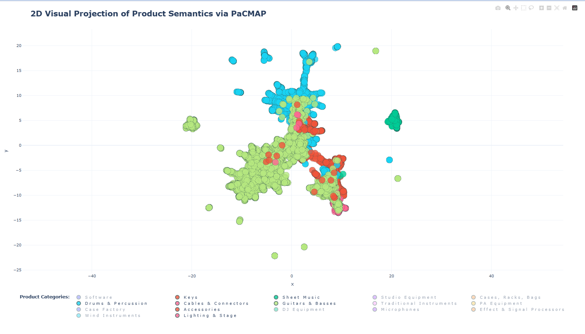

# Advanced RAG Musical product suggestion AI system

A Retrieval-Augmented Generation (RAG) system built to recommend musical instruments and products based on a user's query that contains description of what user has used/bought and what he is looking for.

The platform leverages an asynchronous microservices architecture powered by **vLLM** for fast local LLM and embedding inference, **RabbitMQ** for reliable message queuing and event-driven architecture, **pgvector** for semantic vector searches, and **uv** for fast, and easy Python dependency management.

---

## 🏗️ Architecture & How It Works

The application is structured as a collection of decoupled services communicating asynchronously in event-driven way::

### Logic Flow
1. **User Query Intake**: The client submits a query describing a user's scenario (e.g., historical interactions, financial goals/wishes, or profile descriptions).
2. **Task Enqueuing**: The `api` worker validates the request and publishes a task to **RabbitMQ**, returning an immediate tracking token to the client.
3. **Background Processing**: The `llm_service` background consumer picks up the task and executes the core RAG pipeline:
   - **Vectorization**: Transforms the user's query into dense embeddings using the `vllm_emb` engine.
   - **Vector Retrieval**: 
     - Performs a cosine similarity semantic search against embedding data inside the **Postgres (pgvector)** database to fetch matching products/instruments.
     - Also performs keyword based BM25s search for documents in trained corpus. 
     - Then merges both results using Reciprocal Rank Fusion (RRF).
   - **Reranking**: Filters and optimizes relevance scores of candidate elements via the cross-encoder.
   - **Context Construction & Generation**: Assembles top-ranked context artifacts alongside historical notes, passing them into the structural LLM generation cluster (`vllm_llm`) to produce localized, tailored recommendations.

---

## 🛠️ Prerequisites

Before launching the pipeline, ensure your system meets the following configuration requirements:

- **Docker & Docker Compose**
- **NVIDIA Container Toolkit**: Required to pass GPU resources into the `vllm` containers. Ensure your host has functional NVIDIA drivers and standard `nvidia-smi` access.
- **Hardware Allocations**:
  - GPU VRAM is statically budgeted via `--gpu-memory-utilization` split among the vLLM model services. Currently tested on local PC GPU (Nvidia RTX3060 - max 12GB GPU)

---

## ⚙️ Environment Configuration

The containers use defined configurations through a root `.env` file. Copy the template from `.env.example`, name it `.env`, and configure it appropriately before starting containers.

---

## 🚀 Docker Startup

### Data Ingest step
1) Build the Dockerfile
```bash
docker compose build
```

2) Run api docker service (since migration files exist no need to rerun `docker compose --profile tools run --rm alembic_gen uv run alembic revision --autogenerate -m "initial migration"`)
```bash
docker compose up -d api  
```

3) Then after successful api service setup we need to run ./src/services/data_ingest_service.py to create embeddings and ingest them into the system db:
```bash
docker compose run --rm api uv run python -m src.services.data_ingest_service
```


### Main AI services system

1) Start rest of the services in order (first api to run migrations and postgres/rabbitmq service)
```bash
docker compose up -d vllm_llm
docker compose up -d vllm_emb
docker compose up -d vllm_reranker
docker compose up -d llm_worker
docker compose up -d broker_worker
docker compose up -d callback_worker
```

2) Test the API with scripts under ./tests/ directory.

---

## 🚀 Data Pipeline Result Examples

1) Electric guitar suggestion::

*User query*: ``I’m looking for a versatile MIDI keyboard controller for music production and film scoring, with 61 semi-weighted keys, velocity sensitivity, aftertouch, and assignable pads/knobs for DAW control.``

*System output (top-5 suggestions)*:
```text
#### [Native Instruments Kontrol S61 MK3 Komplete 26](https://www.thomann.de/intl/native_instruments_kontrol_s61_mk3_komplete_15.htm?type=category)
Price: 879.00€ | Status: 🟢 In Stock
Key Features:
  * Fatar keyboard with polyphonic aftertouch and 61 semi-weighted keys
  * Preconfigured mapping for all NI virtual instruments as well as thousands of Kontakt and NKS-compatible instruments from leading third-party manufacturers such as Arturia, Heavyocity, Korg, Output, Spitfire Audio and u-he
  * Operation via eight touch-sensitive rotary controls and a high-resolution colour screen (1280 x 480 pixels), as well as a 4D controller
  * Tag-based preset browsing: find sounds quickly and preview them instantly
  * DAW integration für Ableton live, Pro Tools, Logic Pro, Cubase, FL Studio, Digital Performer, Bitwig and Studio One
  * DAW integration including navigation through plugin chains, parameter paging, mixer views, track colour synchronisation and bidirectional tempo synchronisation
  * Unified Plugin Control: Direct hands-on control over any third-party instrument in your DAW – beyond NKS
  * Direct connection to Kontakt and Komplete Kontrol
  * Light Guide: RGB lights above each key show drum cells, key switches, chords, keys and more.
  * MIDI templates can be created, managed and switched directly on the keyboard
  * Standalone mode for direct control of synthesizers, drum machines and other MIDI devices
  * Accessibility Helper for visually impaired users: Voice output for all controls and parameters, as well as accessibility support for external hardware synthesizers
  * Includes download software: Komplete Select, Komplete Kontrol, Stradivari Cello, Guitar Rig LE, Izotope Elements Suite, Ableton Live Lite and Hypha
  * Includes a Kontakt instrument of your choice after registration
  * Power supply via USB-C
  * USB C MIDI Interface
  * Includes USB-C to USB-C cable
  * Connectors: USB MIDI, USB-C, sustain and expression pedal inputs, 2x additional freely assignable pedal inputs, MIDI input and output
  * Dimensions (W x D x H): 967.4 x 323 x 86 mm
  * Weight: 6 kg
  * Comprehensive production suite featuring over 80 instruments and effects, as well as over 70 expansion packs
  * Includes Kontakt 8, Massive X, Absynth 6, Guitar Rig 7 Pro, iZotope Elements Suite and much more
  * Easy setup via Native Access 2
  * Seamless integration with Kontrol keyboards and Native Instruments Maschine
 ---


#### [Arturia KeyLab Essential 61 Mk3 Alpine](https://www.thomann.de/intl/arturia_keylab_essential_61_mk3_alpine.htm?type=category)
Price: 211.00€ | Status: 🟢 In Stock
Key Features:
  * 61 Velocity-sensitive keys
  * Built-in creative tools such as hold function, scale mode, chord mode and arpeggiator
  * Prepared for seamless integration with Ableton Live, Apple Logic Pro, Image-Line FL Studio, Steinberg Cubase and Bitwig Studio, as well as Mackie MCU and HUI support
  * Extended integration for Arturia software
  * NKS support for direct control of compatible instruments and effects
  * Eight velocity-sensitive RGB-illuminated pads with bank switch
  * Transport section with eight buttons and four DAW function buttons
  * 2.5" LC display with four context-sensitive buttons and push encoder for value input
  * Nine rotary controls and nine faders in familiar mixer layout
  * Pitchbend and modulation wheel
  * Transpose and octave button
  * Button for selecting the MIDI channel
  * One multi-functional pedal input for sustain pedal, footswitch or expression pedal: 6.3 mm TRS jack
  * MIDI output: 5-pin DIN
  * USB-C connector
  * Dimensions (W x D x H): 890 x 240 x 70 mm
  * Weight: 3.08 kg
  * Colour: Alpine White
  * Includes comprehensive software package with Native Instruments Komplete 15 Select Bundle for a genre of choice for immediate testing and use of NKS functionality, as well as Ableton Live Lite, Arturia Analog Lab and UVI Model D Grand Piano, plus 2 months' access to Loopcloud and a trial subscription with bonus lessons for Melodics
 ---


#### [Novation FLkey Mini](https://www.thomann.de/intl/novation_flkey_mini.htm?type=category)
Price: 109.00€ | Status: 🟢 In Stock
Key Features:
  * With 25 keys
  * Optimised for controlling FL Studio
  * 16 velocity-sensitive pads
  * Eight rotary controllers
  * Touch-sensitive strips for pitch and modulation
  * Step sequencer
  * Control of the channel rack via pads
  * Scale mode
  * Instrument control of FPC and SliceX via pads
  * Preset browsing
  * Custom modes
  * Buttons for recording, playback and octave switching
  * NKS support for direct control of over 2,000 NKS-compatible instruments and effects
  * Includes free Native Instruments Komplete 15 Select Bundle for a genre of choice for immediate testing and use of the NKS functionality
  * Dimensions (W x H x D): 330 x 41 x 172 mm
  * Weight: 689 g
  * Includes USB cable
  * Included software (download versions): FL Studio Producer Edition (six-month trial version), AAS Session Bundle, XLN Addictive Keys Studio Grand Piano, Klevgrand R0Verb and DAW Cassette, as well as Spitfire Audio LABS Expressive Strings and GForce Bass Station plugin
  * Suitable optional bag: Art. 498229 (not included)
  * Sustain pedal input: 6.3 mm jack
  * MIDI output: 3.5 mm mini jack
  * USB
 ---


#### [Behringer DeepMind 12 Case Set](https://www.thomann.de/intl/behringer_deepmind_12_case_set.htm?type=category)
Price: 749.00€ | Status: 🔴 Out of Stock
Key Features:
  * 49 Half-weighted full-size keys
  * Velocity sensitive keys with aftertouch
  * 4 FX engines powered by tc electronic and Klark Teknik
  * 24 oscillators - 2 OSCs and LFOs per voice
  * 3 ADSR generators
  * Switchable 2- or 4-pole low-pass filter per voice
  * High-pass filter
  * 8-Channel modulation matrix
  * 32-Step control sequencer
  * Envelope Depth
  * Key tracking
  * Remote controllable via iPad/PC/Mac, USB, MIDI or built-in Wi-Fi
  * 26 Knobs and one switch per function for direct access to all important parameters in real time
  * 1024 Programme memories
  * Built-in and adjustable Wi-Fi client
  * LC display
  * Dimensions (W x D x H): 822 x 257 x 103 mm
  * Weight: 8.4 kg
  * Designed and engineered in the U.K.
  * Suitable optional bag: Art. 479789 (not included in delivery)
  * suitable optional case: Art. 416352 (not included in delivery)
  * For Behringer Deepmind 12
  * Material: High-quality 7 mm honeycomb plastic
  * 30 x 30 mm Aluminium edges
  * 2 Butterfly latches
  * 1 High-quality synthetic leather grip
  * 2 Locking hinges
  * Steel ball corners
  * Foam padding
  * External dimensions (W x D x H): 89.2 x 35.2 x 18.5 cm
  * Weight: 5.8 kg
  * Colour: Black
  * Made in Germany
 ---


#### [IK Multimedia iRig Keys 2 Pro](https://www.thomann.de/intl/ik_multimedia_irig_keys_2_pro.htm?type=category)
Price: 133.00€ | Status: 🟢 In Stock
Key Features:
  * 37 Standard size velocity sensitive keys
  * Integrated headphone output
  * Volume control
  * 4 Double assignable knobs
  * 1 Assignable push encoder
  * Octave up / down button
  * Program up / down button
  * Setup button
  * Micro USB connection
  * MIDI-In: 2.5 mm jack
  * MIDI-Out: 2.5 mm jack
  * Headphone output: 3.5 mm stereo jack
  * Pedal input: 6.3 mm TRS jack
  * Dimensions: 605 x 212 x 77 mm
  * Weight: 1.87 kg
  * Incl. software package (download after registration), Lightning-micro USB cable 60 cm, USB-A-micro USB cable 60 cm, 2.5 mm jack DIN adapter cable 10 cm and USB-C to micro USB cable
```

## Thomann Product Data Visualization

1) Major selected product category description embedding visualization (full plotly html file available at src/data/product_embeddings_map.html)::

Visible separation between Drums/Percussion, Guitars/Basses and Keys. \
Also Sheet Music embedding cluster being pushed further since that is mostly about books/papers.

   
## 🚀 TODO project future ideas::
1) Use multimodal embedding model to also include the scraped images from each product (https://huggingface.co/jinaai/jina-embeddings-v5-omni-small). 
   Also add option to upload an image file to API that would get embedded and used in search. Use MinIO for S3 style buckets for task request file management. https://github.com/hlf20010508/miniopy-async
2) For each retrieved product before final N-Shot LLM prompt also add selection logic based on their reviews (how positive they are and score those products with more negative rating lower.)
3) 

